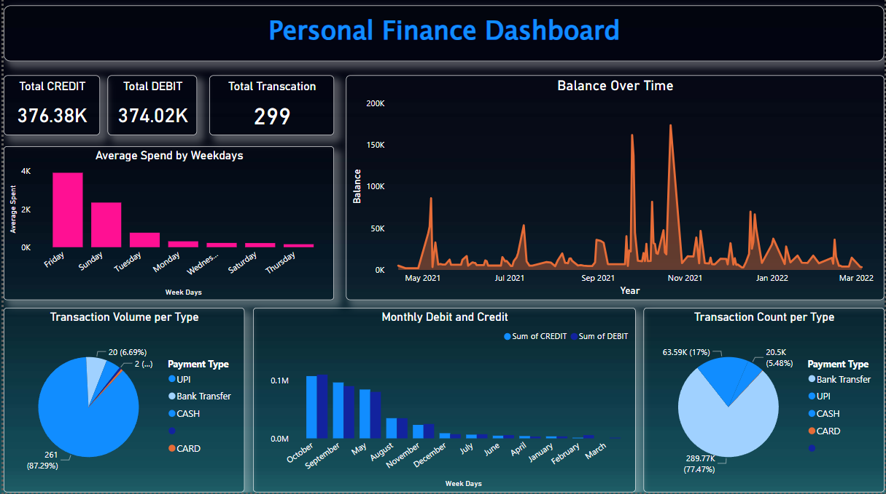

# Personal Finance Dashboard using Bank Statement Data

## Overview
This project is a Personal Finance Dashboard that utilizes bank statement data to provide valuable insights into your spending and financial habits. The dashboard is designed using Power BI and allows you to track your average weekday spending, monthly debits and credits, and analyze transaction patterns based on different payment types.

## Dataset
The dataset used for this dashboard contains the following attributes:

1. Date: The date of each transaction.
2. Description: A brief description of each transaction, which is used to extract payment type information.
3. Credit: The credit amount of the transaction (amount received).
4. Debit: The debit amount of the transaction (amount spent).
5. Balance: The account balance after each transaction.
## Data Preprocessing
Before creating the dashboard, the following data preprocessing steps were performed:

1. Extracting Payment Type: The "Description" field was used to extract the payment type of each transaction. Regular expressions or keyword-based approaches were used to categorize transactions into payment types like "UPI, Card, Internet Banking " etc.

2. Extracting Month and Weekdays: The "Date" field was utilized to extract the month and weekdays (Monday, Tuesday, etc.) of each transaction. This helps in understanding spending patterns over different periods.

## Dashboard Features
The Personal Finance Dashboard provides the following key features:

1. Average Weekdays Spending: A visual representation of your average spending on each weekday. This helps identify which weekdays you tend to spend more and plan your expenses accordingly.

2. Monthly Debit and Credit: A comparison of your monthly debit and credit amounts over time. This allows you to track the inflow and outflow of money throughout the months.

3. Transaction Count and Volume by Payment Type: Insights into the number of transactions and the total transaction volume for each payment type. This helps you understand where your money is going and make informed financial decisions.

## Contributing
Contributions to this project are welcome! If you have any ideas for improvements, new features, or bug fixes, feel free to open an issue or submit a pull request.

Acknowledgments
Special thanks to the open-source community and Power BI for providing the tools and resources to build this personal finance dashboard.

